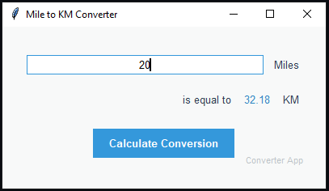

# Mile to Kilometer Converter GUI Application


A modern, user-friendly desktop application for converting miles to kilometers, built with Python and Tkinter.



## Features

- 🎨 **Modern UI Design**
  - Clean, minimalist interface with professional styling
  - Responsive layout that adapts to window size
  - Custom color scheme and typography
- ⚡ **Real-time Conversion**
  - Instant calculation with decimal precision
  - Error handling for invalid inputs
- 📱 **Cross-Platform**
  - Works on Windows, macOS, and Linux
  - Consistent experience across devices
- 🛠 **Enhanced Functionality**
  - Input validation with visual feedback
  - Colored result display
  - Professional button animations

## Installation

1. **Prerequisites**
   - Python 3.7 or higher
   - Tkinter (usually included with Python installations)

2. **Clone the Repository**
   ```bash
   git clone https://github.com/masood2004/Mile_to_KM_Converter.git
   cd Mile_to_KM_Converter
   ```

3. **Run the Application**
   ```bash
   python mile_to_km.py
   ```

## Usage

1. Enter miles value in the input field
2. Click "Calculate Conversion"
3. View converted kilometers in the result area

## Technical Details

**Technology Stack:**
- Python 3.10
- Tkinter GUI Framework
- Object-oriented design pattern

**File Structure:**
```
├── mile_to_km.py            # Main application code
├── README.md                # Documentation
├── LICENSE                  # LICENSE
└── program_screenshot.png   # Program Screenshot
```

**Architecture:**
- MVC-like separation of concerns
- Modular component structure
- Custom styling configuration

## Contributing

We welcome contributions! Please follow these steps:

1. Fork the repository
2. Create your feature branch (`git checkout -b feature/your-feature`)
3. Commit your changes (`git commit -m 'Add some feature'`)
4. Push to the branch (`git push origin feature/your-feature`)
5. Open a Pull Request

**Suggested Improvements:**
- Add unit tests
- Implement dark mode toggle
- Create executable builds for different platforms
- Add conversion history feature

## License

This project is licensed under the MIT License - see the [LICENSE](LICENSE) file for details.

## Acknowledgments

- Tkinter documentation team
- Python Software Foundation
- Inspired by real-world unit conversion needs

---

**Maintainer:** [Syed Masood Hussain](https://github.com/masood2004)  
**Support:** Please open an issue for any questions or problems
